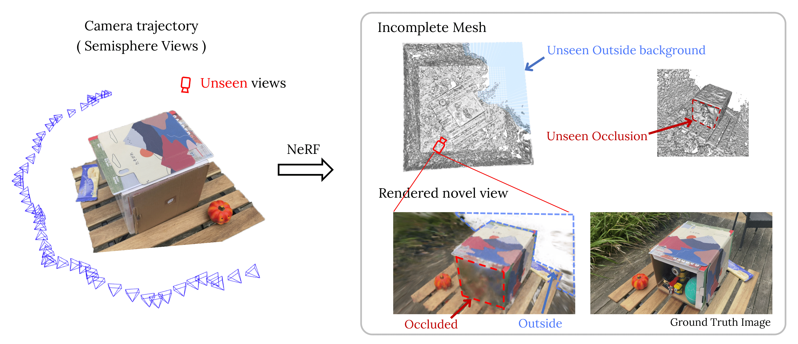
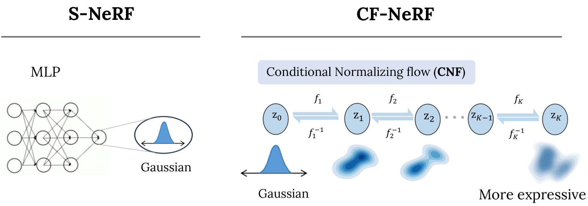
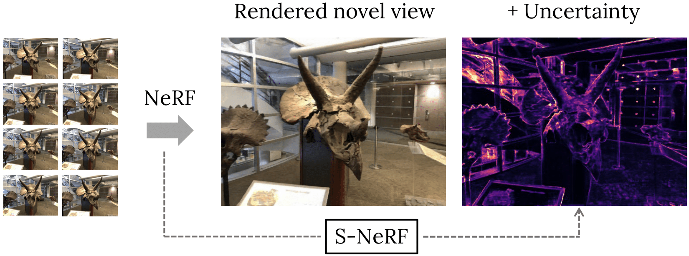

🎯🎯找工作中，欢迎随时联系 !!

邮件：15549298924@163.com
微信：poetrywonderer

I am now a Ph.D. student at [IRI-UPC](http://www.iri.upc.edu/) under the supervision of [Francesc Moreno-Noguer](http://www.iri.upc.edu/people/fmoreno/) 
and [Adria Ruiz](https://scholar.google.es/citations?user=h5cFva0AAAAJ&hl=ca). Before that, I received the Master's and Bachelor's degrees from Harbin Institute of Technology ([HIT](http://studyathit.hit.edu.cn/)) in China.

My research is in areas of computer vision and machine learning. My previous work involves in exploring the interpretability of 3D Scene Modeling mainly on NeRF, particularly the uncertainty beyond 3D models, with few source data. 

My recent interest lies in exploring the amazing 3DGS ～

## News
<!-- 无序列表 -->
<ul>
    <li>[2024.1.29] One paper got accepted to ICRA 2024! See u there &#128526;</li>
    <li>[2023.12.21] Excited to start an intern in Tecent AI Lab (Shenzhen)!</li>
    <li>...</li>
</ul>

## Publications

Here is a selection of recent publications, full list can be found on [Google Scholar](https://scholar.google.com/citations?hl=en&user=2L7sQVQAAAAJ).

<!-- 2023 ICRA submission -->
<article class="row">
  

    <figure class="image">
      
    </figure>
  

  

    <figure class="image">
      
    </figure>
  

  

    

      

        <b>Estimating 3D Uncertainty Field: Quantifying Uncertainty for Neural Radiance Fields</b> 
        <b>Jianxiong Shen</b>, Ruijie Ren, Adria Ruiz, Francesc Moreno-Noguer 
        <i>Accepted to ICRA 2024!</i> 
        <a href="https://arxiv.org/abs/2311.01815" >Paper</a>&nbsp;&nbsp;&nbsp;
      

    

  

</article>

<!-- 2022 CF-NeRF -->
<article class="row">
  

    <figure class="image">
      
    </figure>
  

  

    <figure class="image">
      
    </figure>
  

  

    

      

        <b>Conditional-Flow NeRF: Accurate 3D modelling with Reliable Uncertainty Estimation</b> 
        <b>Jianxiong Shen</b>, Antonio Agudo, Francesc Moreno-Noguer, Adria Ruiz 
        <i>ECCV 2022</i> 
        <a href="https://poetrywanderer.github.io/CF-NeRF/" >Project Page</a>&nbsp;&nbsp;&nbsp;
        <a href="https://arxiv.org/abs/2203.10192" >Paper</a>&nbsp;&nbsp;&nbsp;
        <a href="https://github.com/poetrywanderer/CF-NeRF" >Code</a>&nbsp;&nbsp;&nbsp;
        <a href="../files/Spotlight_CF-NeRF.pptx" >Slide</a>&nbsp;&nbsp;&nbsp;
        <a href="../files/ECCV-Poster-7028.pptx" >Poster</a>&nbsp;&nbsp;&nbsp;
        <!-- <a href="https://arxiv.org/abs/2207.01567" target="_blank">[paper]</a>
        <a href="https://github.com/dulucas/siMLPe" target="_blank">[Code]</a> -->
        <a onclick="javascript:ShowHide('#bibtex')" href="javascript:;">Bibtex</a>
        <pre class='citation' id='bibtex' style="DISPLAY: none">
        @inproceedings{jshen2022cfnerf,
            Author = {Jianxiong, Shen and Agudo, Antonio and Moreno-Noguer, Francesc and Ruiz, Adria}
            Title = {Conditional-Flow NeRF: Accurate 3D modelling with Reliable Uncertainty Estimation},
            Year = {2022},
            booktitle = {ECCV},
        }
        </pre>
      

    

  

</article>

<!-- 2021 3DV -->
<article class="row">
  

    <figure class="image">
      
    </figure>
  

  

    <figure class="image">
      
    </figure>
  

  

    

      

        <b>Stochastic Neural Radiance Fields: Quantifying Uncertainty in Implicit 3D Representations</b> 
        <b>Jianxiong Shen</b>, Adria Ruiz, Antonio Agudo, Francesc Moreno-Noguer 
        <i>3DV 2021 </i> 
        <a href="https://arxiv.org/abs/2109.02123" >Paper</a>&nbsp;&nbsp;&nbsp;
        <a href="../files/3DV-Poster-159.pptx" >Poster</a>&nbsp;&nbsp;&nbsp;
        <!-- <a href="https://arxiv.org/abs/2207.01567" target="_blank">[paper]</a>
        <a href="https://github.com/dulucas/siMLPe" target="_blank">[Code]</a> -->
        <a onclick="javascript:ShowHide('#bibtex')" href="javascript:;">Bibtex</a>
        <pre class='citation' id='bibtex' style="DISPLAY: none">
        @inproceedings{jshen2021snerf,
            Author = {Jianxiong, Shen and Ruiz, Adria and Agudo, Antonio and Moreno-Noguer, Francesc}
            Title = {Stochastic Neural Radiance Fields: Quantifying Uncertainty in Implicit 3D Representations},
            Year = {2021},
            booktitle = {3DV},
        }
        </pre>
      

    

  

</article>

## Academic Talk
- [ACMCV 2022](http://acmcv.cat/), 2022.09
- [DLBCN 2022](https://sites.google.com/view/dlbcn2022/home?authuser=0), 2022.12

## Contact

<article class="row">
  

    <figure class="image">
      
    </figure>
  

</article>